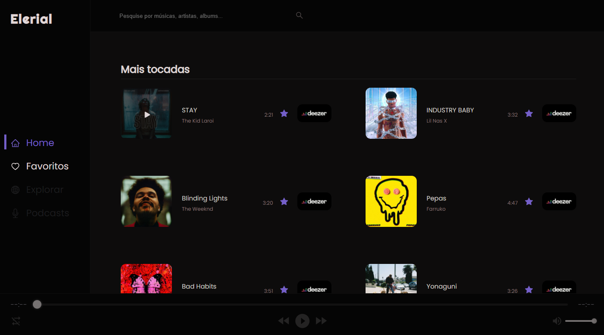

## Elerial

Elerial é um Webapp de listagem e pré-visualização de músicas.

- [Elerial URL](https://elerialmusic.netlify.app/)

## Favoritas

As músicas favoritas são salvas através do redux-persist-store.

## Instalação e configuração.

Faça um clone desse repositório. Tenha instalado `npm` e `node` na sua máquina.

Instalação:

`npm install`

Para iniciar o servidor:

`npm start`

Para acessar:

`http://localhost:3000/`

## Tecnologias utilizadas

- [Deezer API](https://developers.deezer.com/api)
- [ReactJS](https://pt-br.reactjs.org/)
- [Redux](https://redux.js.org/)
- [react-h5-audio-player](https://www.npmjs.com/package/react-h5-audio-player)
- [React icons](https://react-icons.github.io/react-icons/)
- [axios](https://github.com/axios/axios)
- [Styled Components](https://styled-components.com/)
